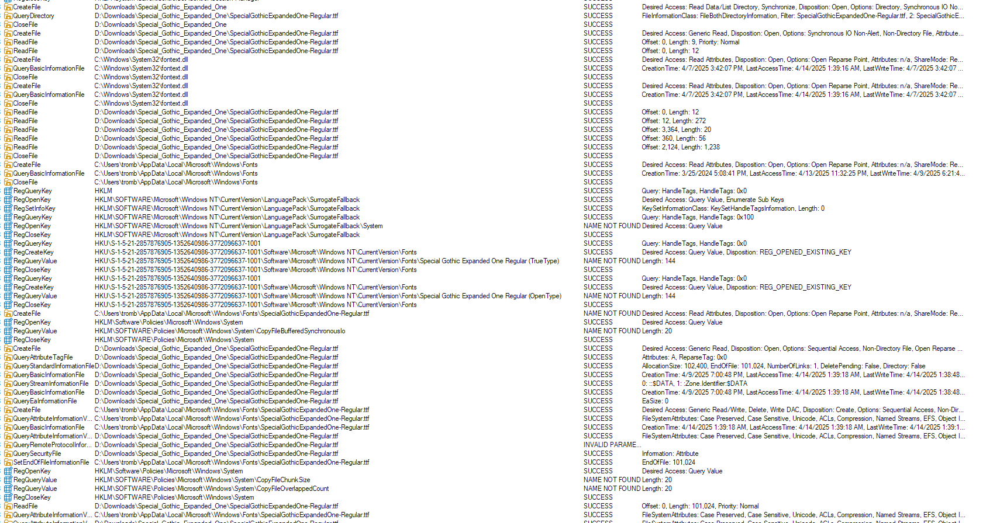
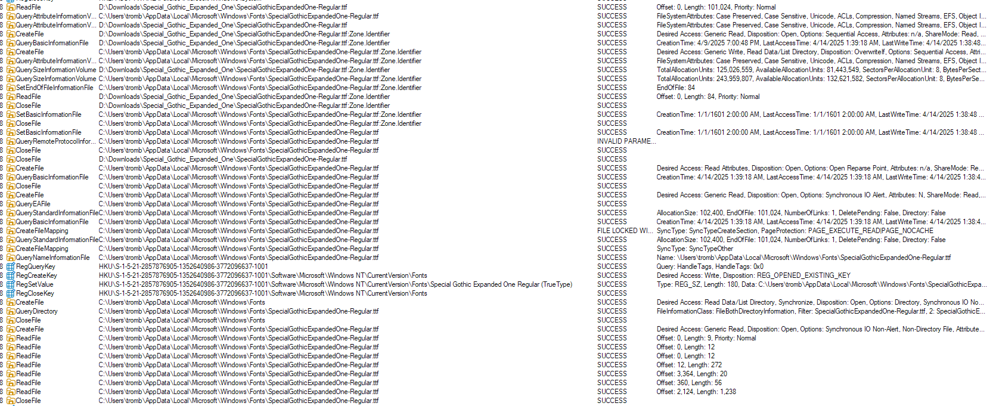

# File Explorer User Installation Analysis Via ProcMon

_The goal of this analysis was to find out what the context-menu user installation button really does in Windows 11's File Explorer. Reason: to document and mimic the behavior in third-party tools._

## Setup

First, I installed ProcMon via winget (in an administrator terminal) and I lauched it via PowerShell:

```ps
winget install Microsoft.Sysinternals.ProcessMonitor --scope=machine
procmon
```

Secondly, I got the font file `SpecialGothicExpandedOne-Regular.ttf` from https://fonts.google.com/specimen/Special+Gothic+Expanded+One and put it in my downloads folder.

I started ProcMon, quickly paused captures, disabled "Show Network Activity" and "Show Process And Thread Activity", and erased the captured.

Then I quickly unpaused, installed the font via File Explorer's "Install" context menu option and paused again. These are the relevant results (some overlap):





## Analysis

First it opens and queries the `D:\Downloads\Specia_Gothic_Expanded_One` folder. Then it finds the `SpecialGothicExpandedOne-Regular.ttf` file and closes the directory handle. This is pretty interesting behaviour because I specifically invoked the context menu on _the file_, not the directory.

Then it opens the font file in read-only mode and reads seven times:

1. Offset: 0, length: 9, priority: normal
2. Offset: 0, length: 12
3. Offset: 0, length: 12
4. Offset: 12, length: 272
5. Offset: 3364, length: 56
6. Offset: 2124, length: 1238

(We ignore the calls related to `C:\Windows\System32\fontext.dll` because I believe that it has nothing to with the installation.)

Interpretation: TODO

Then it closes the font file and reads the basic information of `C:\Users\<USER>\AppData\Local\Microsoft\Windows\Fonts` (the local font directory, information [here](./WINDOWS.md)).

Interpretation TODO:

After that, it opens `HKEY_LOCAL_MACHINE\SOFTWARE\Microsoft\Windows NT\CurrentVersion\LanguagePack\SurrogateFallback` sets some info, queries the `System` subkey (fails) and closes the keys.

Interpretation: TODO

Then it queries `HKEY_USERS\<USER_ID>\Software\Microsoft\Windows NT\CurrentVersion\Fonts`'s values to check if the font name including suffix is there, suffix meaning `(TrueType)` or `(OpenType)`. In this case it is checking for `Special Gothic Expanded One Regular` + suffix. Then it is checking for an equally named file in the user's fonts directory.

Interpretation: This is presumably to check if the font is already installed. Because the font is not already installed, it continues.

Then it checks `HKEY_LOCAL_MACHINE\SOFTWARE\Policies\Microsoft\Windows\System\copyFileBuffered\Synchronouslo`.

Interpretation: TODO

Then it opens the font file and queries:

* File attributes
* Standard file information:
  * Allocation size
  * End of file
  * Number of links
  * Delete pending
  * (Directory)
* Basic file information:
  * Creation time
  * Last access time
  * last write time
* Stream file information
* Ea information (size) (?)

After that it creates the target file in the user's font directory and queries information.

TODO